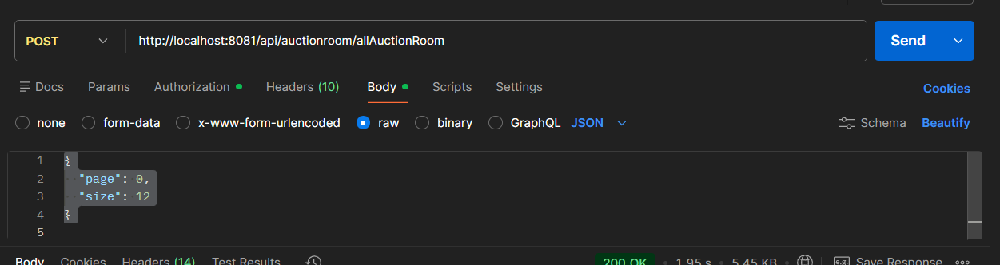
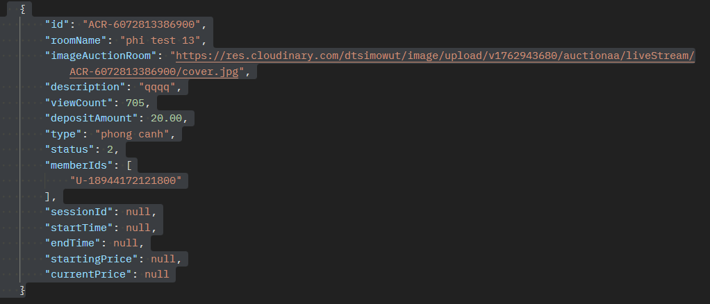

# Phân trang

## 1. Phân Trang cho auctionRoom

### Test postMan

> Method: Post
> Url: http://localhost:8081/api/auctionroom/allAuctionRoom
> Tham số truyền vào:
> - token
    > 
>
>
> - Body-raw-json
    > {
    "page": 0,
    "size": 12
    }
    
>
> -Ví dụ nếu muốn load trang tiếp theo:
> * Trang 1:
    > {
    "page": 1,
    "size": 12
    }
> * Trang 2:
    > {
    "page": 2,
    "size": 12
    }

### Kết quả trả về sau khi test

> - Là 12 phòng đấu giá với cấu trúc như sau
>
> 

## 2 Phân trang cho history-profile

### Test postMan

> Method: Post
> Url: http://localhost:8081/api/auctionroom/history
> Tham số truyền vào:
> - token
    > 
>
>
> - Body-raw-json
    > {
    "page": 0,
    "size": 12
    }
    
>
> -Ví dụ nếu muốn load trang tiếp theo:
> * Trang 1:
    > {
    "page": 1,
    "size": 12
    }
> * Trang 2:
    > {
    "page": 2,
    "size": 12
    }

### Kết quả trả về sau khi test

> - Là phòng đấu giá mà có UserId đó trong memberlist của phòng đó với cấu trúc như sau
>
> 

## 3 Phân trang cho my-invoice

### Test postMan

> Method: Post
> Url: http://localhost:8081/api/invoice/my-invoice
> Tham số truyền vào:
> - token
    > 
>
>
> - Body-raw-json
    > {
    "page": 0,
    "size": 12
    }
    
>
> -Ví dụ nếu muốn load trang tiếp theo:
> * Trang 1:
    > {
    "page": 1,
    "size": 12
    }
> * Trang 2:
    > {
    "page": 2,
    "size": 12
    }

### Kết quả trả về sau khi test

> - Là tất cả Hóa đơn mà có User đó là UserId có cấu trúc như sau
>
> 

